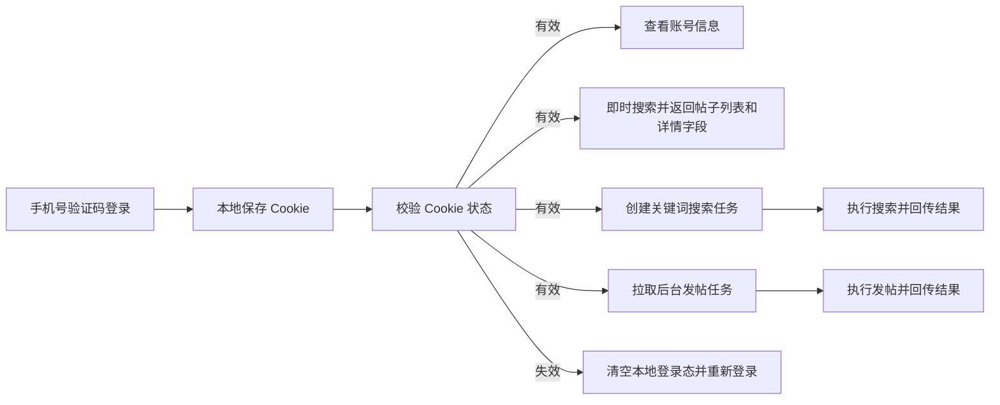

# Android 技术方案

## 分层

```text
ui/
  AppScreen.kt          登录态判断、首页导航和全局状态
  AppModules.kt         登录页、发帖、搜索、我的页面
  theme/                Android 视觉 token 和排版
data/
  BackendClient.kt     后台 HTTP 调用
  BackendModels.kt     任务和配置模型
  AppConfigStore.kt    SharedPreferences 配置持久化
xhs/
  XhsAutomation.kt     后续真实登录、发帖、搜索和账号信息接口
```

## 执行流程



## 首期实现策略

当前版本先打通后台连接、手机号验证码登录、Cookie 保存、Cookie 状态校验和任务回传链路。小红书真实 UI 操作暂时用 `XhsAutomation` 占位，后续替换为无障碍服务或 UIAutomator 执行器。

| 能力 | 当前实现 | 后续实现 |
|---|---|---|
| 主 Cookie 保存 | 手机号/短信登录后自动提取并本地保存，同时写入后台账号记录 | 本地加密保存 |
| Cookie 状态校验 | 启动时和手动触发时调用后台校验接口，失效后强制重新登录 | 增加更细的缓存和过期策略 |
| 发帖任务 | 可拉取并回传模拟结果 | 使用本地 Cookie 发布图文/视频 |
| 搜索任务 | 可创建、查看列表和详情 | 使用本地 Cookie 搜索关键词、采集结果 |
| 账号信息 | 预留展示入口 | 查询当前登录账号资料和帖子数据 |

## 页面模块

当前 Android 页面分成登录页和首页两层：

| 页面/模块 | 作用 |
|---|---|
| 登录页 | 启动时检查登录状态，未登录时输入手机号和验证码完成登录 |
| 首页发帖 Tab | 拉取后台创建的发帖任务，手动填写结果并回传 |
| 首页搜索 Tab | 即时搜索、创建关键词任务、查看任务列表、点击帖子进入详情页 |
| 首页我的 Tab | 查看账号摘要、校验状态、切换中英文、退出登录、维护后台地址 |

视觉与国际化规则见 [UI_STYLE_GUIDE.md](./UI_STYLE_GUIDE.md)。

## 风控边界

1. 发帖任务只执行后台已审核并下发的任务。
2. 关键词搜索任务由 App 创建，但必须限制单次数量和请求间隔。
3. 同一账号不并发执行多个小红书业务请求。
4. App 不记录明文 Cookie。
5. 搜索详情字段优先复用搜索接口返回数据，不对每条结果追加详情请求。
6. Cookie 校验失败后，不继续执行搜索、发帖和账号查询动作。
