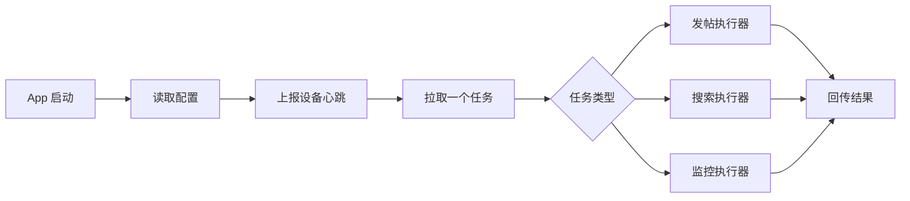

# Android 技术方案

## 分层

```text
ui/
  AppScreen.kt          管理界面和手动调试入口
data/
  BackendClient.kt     后台 HTTP 调用
  BackendModels.kt     任务和配置模型
  AppConfigStore.kt    SharedPreferences 配置持久化
xhs/
  XhsAutomation.kt     小红书执行器接口和占位实现
```

## 执行流程



## 首期实现策略

当前版本先实现后台连接和任务回传骨架。小红书真实 UI 操作暂时用 `XhsAutomation` 占位，后续替换为无障碍服务或 UIAutomator 执行器。

| 能力 | 当前实现 | 后续实现 |
|---|---|---|
| 主 Cookie 同步 | 手动粘贴 Cookie 并上报 | 手机号/短信登录后自动提取 |
| 发帖任务 | 可拉取并回传模拟结果 | 打开 XHS、上传素材、发布 |
| 搜索任务 | 可拉取并回传模拟结果 | 搜索关键词、滚动、采集结果 |
| 账号监控 | 可拉取并回传模拟快照 | 进入个人页和帖子详情采集 |

## 风控边界

1. App 不绕过后台任务分配。
2. App 不本地批量生成任务。
3. App 不并发执行多个任务。
4. App 不记录明文 Cookie。
5. 真正执行小红书操作前必须检查任务类型和 Cookie 用途。
