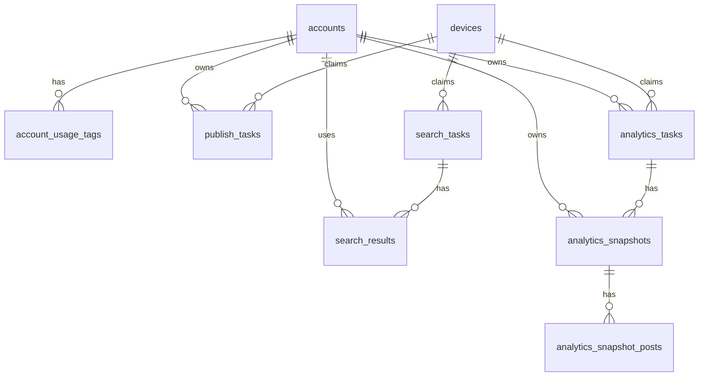

# 数据库设计

## 1. 选型结论

建议使用 **PostgreSQL 16**。

原因：

| 维度 | PostgreSQL | SQLite | MySQL |
|---|---|---|---|
| 并发写入 | 好 | 弱 | 好 |
| 事务与行级锁 | 好 | 弱 | 好 |
| JSON 字段 | 强 | 一般 | 可用 |
| 任务调度场景 | 适合 | 不适合 | 可用 |
| 日志与审计扩展 | 适合 | 一般 | 可用 |
| 本项目匹配度 | 最优 | 仅适合单机原型 | 次优 |

结论：

- 当前项目已经不是纯本地单用户小工具。
- 后面会有 Web 管理后台、App 拉发帖任务、App 创建搜索任务、任务状态流转、结果查询、日志审计。
- 这些场景都更适合 PostgreSQL。

不建议继续把核心数据放在 JSON 文件里。

## 2. 技术建议

建议组合：

| 组件 | 建议 |
|---|---|
| 数据库 | PostgreSQL 16 |
| ORM | SQLAlchemy 2.x |
| 迁移 | Alembic |
| Python 驱动 | psycopg 3 |

建议原则：

- 结构化主数据进 PostgreSQL。
- 少量运行时缓存可留在内存。
- 不再把任务、结果、Cookie 池、日志存到 `operations.json`。

## 3. 设计原则

### 3.1 数据分层

| 类型 | 存储方式 |
|---|---|
| 账号、Cookie 池、任务、结果、日志 | PostgreSQL |
| App 最近活动 | 可由任务领取、任务创建和结果回传刷新，不要求独立心跳 |
| 媒体文件本体 | 不入库，只存 URL 和元数据 |

### 3.2 敏感信息

| 字段 | 建议 |
|---|---|
| Cookie 原文 | 数据库存储，但前端永不返回 |
| Cookie 预览 | 单独生成脱敏字段或接口层处理 |
| 审计日志 | 不写完整 Cookie |

### 3.3 任务并发控制

建议依赖数据库保证：

- 同一主账号同一时刻仅一个发帖任务处于 `claimed/running`
- 同一设备同一时刻仅一个任务处于 `claimed/running`
- 同一账号同一时刻仅服务一个运行中任务

## 4. 核心枚举

### 4.1 账号类型

| 值 | 说明 |
|---|---|
| `primary` | 主账号 |
| `worker` | 小号 |

### 4.2 Cookie 状态

| 值 | 说明 |
|---|---|
| `active` | 可分配 |
| `cooldown` | 冷却中 |
| `invalid` | 已失效 |
| `disabled` | 人工停用 |

### 4.3 任务类型

| 值 | 说明 |
|---|---|
| `publish` | 发帖 |
| `search` | 关键词采集 |
| `analytics` | 账号监控 |

### 4.4 任务状态

| 值 | 说明 |
|---|---|
| `pending` | 待执行 |
| `claimed` | 已领取 |
| `running` | 执行中 |
| `success` | 执行成功 |
| `failed` | 执行失败 |
| `cancelled` | 已取消 |

### 4.5 审核状态

| 值 | 说明 |
|---|---|
| `pending` | 待审核 |
| `approved` | 已通过 |
| `rejected` | 已拒绝 |

## 5. 表设计

## 5.1 `accounts`

用途：主账号与小号统一表。

| 字段 | 类型 | 说明 |
|---|---|---|
| `id` | `uuid` PK | 主键 |
| `account_type` | `varchar(20)` | `primary` / `worker` |
| `name` | `varchar(100)` | 账号名称 |
| `nickname` | `varchar(100)` | 最近识别昵称 |
| `user_uid` | `varchar(100)` | 小红书账号 UID，用于主账号去重复用 |
| `cookies` | `text` | 原始 Cookie |
| `cookie_preview` | `varchar(64)` | 脱敏预览 |
| `status` | `varchar(20)` | `active/cooldown/invalid/disabled` |
| `group_name` | `varchar(100)` | 品牌组 / 项目组 |
| `remark` | `text` | 备注 |
| `last_check_at` | `timestamptz` | 最近校验时间 |
| `last_use_at` | `timestamptz` | 最近使用时间 |
| `last_failure_at` | `timestamptz` | 最近失败时间 |
| `failure_count` | `int` | 连续失败次数 |
| `cooldown_until` | `timestamptz` | 冷却截止时间 |
| `bound_device_id` | `varchar(100)` | 主账号默认绑定设备 |
| `created_at` | `timestamptz` | 创建时间 |
| `updated_at` | `timestamptz` | 更新时间 |

索引建议：

- `idx_accounts_type_status`
- `idx_accounts_group_name`
- `idx_accounts_last_use_at`

## 5.2 `account_usage_tags`

用途：小号用途标签。

| 字段 | 类型 | 说明 |
|---|---|---|
| `id` | `uuid` PK | 主键 |
| `account_id` | `uuid` FK | 关联 `accounts.id` |
| `usage_tag` | `varchar(50)` | `worker_search` / `worker_analytics` / `worker_backup` |

唯一约束：

- `(account_id, usage_tag)`

## 5.3 `devices`

用途：App 实例标识和最近活动记录。独立心跳不是首期必需流程。

| 字段 | 类型 | 说明 |
|---|---|---|
| `id` | `uuid` PK | 主键 |
| `device_id` | `varchar(100)` | 设备标识 |
| `app_instance_id` | `varchar(100)` | 安装实例标识 |
| `device_name` | `varchar(100)` | 设备名 |
| `app_version` | `varchar(50)` | App 版本 |
| `status` | `varchar(20)` | `online/offline/disabled` |
| `last_heartbeat_at` | `timestamptz` | 兼容字段，可表示最近活动 |
| `last_seen_ip` | `varchar(100)` | 可选 |
| `created_at` | `timestamptz` | 创建时间 |
| `updated_at` | `timestamptz` | 更新时间 |

唯一约束：

- `(device_id, app_instance_id)`

## 5.4 `publish_tasks`

用途：发帖任务。

| 字段 | 类型 | 说明 |
|---|---|---|
| `id` | `uuid` PK | 主键 |
| `account_id` | `uuid` FK | 主账号 |
| `title` | `varchar(120)` | 标题 |
| `content` | `text` | 正文 |
| `topics_json` | `jsonb` | 话题列表 |
| `location` | `varchar(120)` | 地点 |
| `media_type` | `varchar(20)` | `image/video` |
| `media_urls_json` | `jsonb` | 媒体 URL 列表 |
| `cover_url` | `text` | 视频封面 |
| `review_status` | `varchar(20)` | 审核状态 |
| `task_status` | `varchar(20)` | 任务状态 |
| `scheduled_at` | `timestamptz` | 计划执行时间 |
| `claimed_by_device_id` | `varchar(100)` | 领取设备 |
| `claim_expires_at` | `timestamptz` | 领取过期时间 |
| `retry_count` | `int` | 已重试次数 |
| `max_retry` | `int` | 最大重试次数 |
| `last_error` | `text` | 最近错误 |
| `published_post_id` | `varchar(100)` | 发布后帖子 ID |
| `published_post_url` | `text` | 发布后链接 |
| `created_by` | `varchar(100)` | 创建人 |
| `created_at` | `timestamptz` | 创建时间 |
| `updated_at` | `timestamptz` | 更新时间 |

索引建议：

- `idx_publish_tasks_status`
- `idx_publish_tasks_account_id`
- `idx_publish_tasks_scheduled_at`
- `idx_publish_tasks_claimed_by`

## 5.5 `search_tasks`

用途：关键词搜索任务。首期由 App 创建，后台保存任务和结果。

| 字段 | 类型 | 说明 |
|---|---|---|
| `id` | `uuid` PK | 主键 |
| `keyword` | `varchar(200)` | 关键词 |
| `group_name` | `varchar(100)` | 品牌组 / 项目组 |
| `require_num` | `int` | 单次采集数量 |
| `sort_type` | `varchar(30)` | 排序 |
| `note_type` | `varchar(30)` | 内容类型 |
| `time_range` | `varchar(30)` | 时间范围 |
| `interval_minutes` | `int` | 执行间隔 |
| `enabled` | `boolean` | 是否启用 |
| `task_status` | `varchar(20)` | 当前状态 |
| `claimed_by_device_id` | `varchar(100)` | 领取设备 |
| `assigned_worker_account_id` | `uuid` FK | 可选，后续启用小号池时记录分配的小号 |
| `claim_expires_at` | `timestamptz` | 领取过期时间 |
| `last_run_at` | `timestamptz` | 最近执行时间 |
| `last_success_at` | `timestamptz` | 最近成功时间 |
| `last_error` | `text` | 最近错误 |
| `retry_count` | `int` | 已重试次数 |
| `max_retry` | `int` | 最大重试次数 |
| `created_at` | `timestamptz` | 创建时间 |
| `updated_at` | `timestamptz` | 更新时间 |

## 5.6 `search_results`

用途：关键词采集结果。

| 字段 | 类型 | 说明 |
|---|---|---|
| `id` | `uuid` PK | 主键 |
| `search_task_id` | `uuid` FK | 任务 ID |
| `result_id` | `varchar(100)` | App 回传结果 ID |
| `worker_account_id` | `uuid` FK | 可选，后续启用小号池时记录使用的小号 |
| `post_id` | `varchar(100)` | 帖子 ID |
| `post_url` | `text` | 帖子链接 |
| `title` | `varchar(300)` | 标题 |
| `content_preview` | `text` | 摘要 |
| `author_id` | `varchar(100)` | 作者 ID |
| `author_name` | `varchar(100)` | 作者名 |
| `like_count` | `int` | 点赞数 |
| `comment_count` | `int` | 评论数 |
| `collect_count` | `int` | 收藏数 |
| `publish_time` | `timestamptz` | 发布时间，可空 |
| `raw_payload` | `jsonb` | 原始回传体 |
| `review_status` | `varchar(20)` | 人工处理状态 |
| `review_note` | `text` | 人工备注 |
| `hidden` | `boolean` | 是否隐藏 |
| `created_at` | `timestamptz` | 创建时间 |

唯一约束建议：

- `(search_task_id, post_id)`
- `(search_task_id, result_id, post_id)`

## 5.7 `analytics_tasks`

用途：账号监控任务。

| 字段 | 类型 | 说明 |
|---|---|---|
| `id` | `uuid` PK | 主键 |
| `account_id` | `uuid` FK | 主账号 |
| `group_name` | `varchar(100)` | 分组 |
| `interval_minutes` | `int` | 执行间隔，建议 >= 360 |
| `enabled` | `boolean` | 是否启用 |
| `task_status` | `varchar(20)` | 当前状态 |
| `claimed_by_device_id` | `varchar(100)` | 领取设备 |
| `assigned_worker_account_id` | `uuid` FK | 分配的小号 |
| `claim_expires_at` | `timestamptz` | 领取过期时间 |
| `last_run_at` | `timestamptz` | 最近执行时间 |
| `last_success_at` | `timestamptz` | 最近成功时间 |
| `last_error` | `text` | 最近错误 |
| `retry_count` | `int` | 已重试次数 |
| `max_retry` | `int` | 最大重试次数 |
| `created_at` | `timestamptz` | 创建时间 |
| `updated_at` | `timestamptz` | 更新时间 |

## 5.8 `analytics_snapshots`

用途：账号监控快照。

| 字段 | 类型 | 说明 |
|---|---|---|
| `id` | `uuid` PK | 主键 |
| `analytics_task_id` | `uuid` FK | 任务 ID |
| `result_id` | `varchar(100)` | App 回传结果 ID |
| `account_id` | `uuid` FK | 主账号 |
| `worker_account_id` | `uuid` FK | 使用的小号 |
| `nickname` | `varchar(100)` | 昵称 |
| `follower_count` | `int` | 粉丝数 |
| `liked_total` | `int` | 获赞总数 |
| `post_total` | `int` | 发帖总数 |
| `collected_total` | `int` | 被收藏总数，可空 |
| `raw_payload` | `jsonb` | 原始快照 |
| `created_at` | `timestamptz` | 创建时间 |

唯一约束建议：

- `(analytics_task_id, result_id)`

## 5.9 `analytics_snapshot_posts`

用途：快照下的帖子明细。

| 字段 | 类型 | 说明 |
|---|---|---|
| `id` | `uuid` PK | 主键 |
| `snapshot_id` | `uuid` FK | 快照 ID |
| `post_id` | `varchar(100)` | 帖子 ID |
| `title` | `varchar(300)` | 标题 |
| `post_url` | `text` | 链接 |
| `like_count` | `int` | 点赞数 |
| `comment_count` | `int` | 评论数 |
| `collect_count` | `int` | 收藏数 |
| `publish_time` | `timestamptz` | 发布时间，可空 |
| `raw_payload` | `jsonb` | 原始帖子数据 |

唯一约束建议：

- `(snapshot_id, post_id)`

## 5.10 `task_results`

用途：统一记录任务回传，便于幂等。

| 字段 | 类型 | 说明 |
|---|---|---|
| `id` | `uuid` PK | 主键 |
| `task_type` | `varchar(20)` | `publish/search/analytics` |
| `task_id` | `uuid` | 对应任务 ID |
| `result_id` | `varchar(100)` | App 回传 ID |
| `device_id` | `varchar(100)` | 设备 ID |
| `app_instance_id` | `varchar(100)` | 安装实例 |
| `status` | `varchar(20)` | 成功 / 失败 / 部分成功 |
| `duration_seconds` | `int` | 执行耗时 |
| `error_message` | `text` | 错误信息 |
| `payload` | `jsonb` | 原始回传体 |
| `created_at` | `timestamptz` | 创建时间 |

唯一约束：

- `(task_id, result_id)`

## 5.11 `audit_logs`

用途：审计和运营日志。

| 字段 | 类型 | 说明 |
|---|---|---|
| `id` | `uuid` PK | 主键 |
| `log_type` | `varchar(50)` | `task_claim/cookie_assign/risk_event/manual_action/app_result` |
| `operator_type` | `varchar(20)` | `system/web/app` |
| `operator_id` | `varchar(100)` | 操作者标识 |
| `target_type` | `varchar(50)` | 作用对象类型 |
| `target_id` | `varchar(100)` | 作用对象 ID |
| `message` | `text` | 日志内容 |
| `payload` | `jsonb` | 附加信息 |
| `created_at` | `timestamptz` | 创建时间 |

## 6. 关系概览

## 7. 第一阶段迁移建议

1. 先引入 PostgreSQL、SQLAlchemy、Alembic。
2. 建 `accounts`、`account_usage_tags`、`devices`。
3. 建 `publish_tasks`、`search_tasks`、`analytics_tasks`。
4. 建 `search_results`、`analytics_snapshots`、`analytics_snapshot_posts`。
5. 建 `task_results` 和 `audit_logs`。
6. 停止对 `datas/accounts.json`、`datas/operations.json` 的主流程写入。

## 8. 可以后补的东西

| 项目 | 是否首期必须 |
|---|---|
| Redis 队列 | 否 |
| 对 Cookie 加密落库 | 建议尽快，但不是首期阻塞项 |
| 分区表 | 否 |
| 多租户权限表 | 否 |
| 对象存储素材中心 | 否 |
