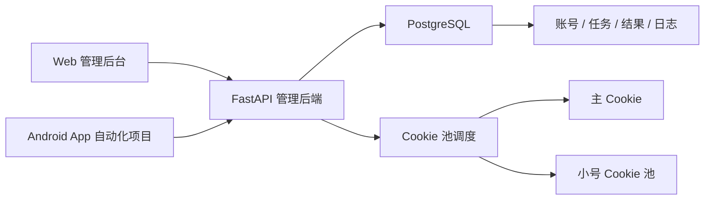
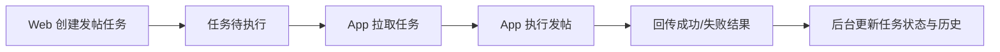
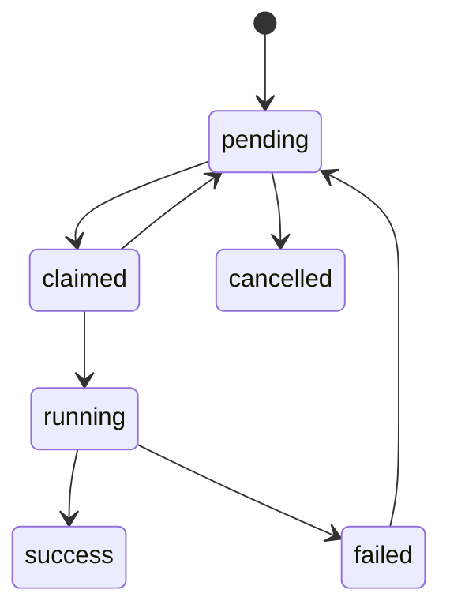
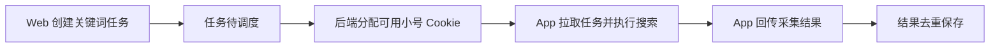
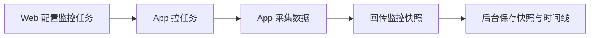

# 技术方案

## 1. 目标

本项目调整为“小红书 App 自动化的管理后台与接口服务”。

职责边界：

| 模块 | 职责 |
|---|---|
| Android App 项目 | 登录、发帖、搜索采集、账号数据采集、结果回传 |
| 本项目后端 | 账号管理、Cookie 池管理、任务管理、结果存储、风控控制 |
| 本项目 Web | 管理后台，只做配置、查看、审核和状态管理 |

## 2. 改造原则

### 2.1 复用部分

| 当前能力 | 是否复用 | 说明 |
|---|---|---|
| FastAPI 服务框架 | 复用 | 继续作为后端入口 |
| JSON 本地存储 | 复用 | 继续作为第一阶段存储方案 |
| `RiskGuard` 限速与失败冷却 | 复用并扩展 | 扩展到 Cookie 池和任务执行链路 |
| 账号 Cookie 脱敏展示 | 复用 | 继续保留 |
| 运营任务与结果存储思路 | 复用并重构 | 保留思路，字段按新模型调整 |
| 前端 React + Vite + Tailwind | 复用 | 仅改管理台页面结构 |

### 2.2 删除部分

| 当前能力 | 处理方式 | 原因 |
|---|---|---|
| Web 直接发帖 | 删除 | 发帖改为 App 执行 |
| Web 直接搜索采集 | 删除核心流程 | 搜索改为 App 执行 |
| 评论自动回复 | 删除 | 不在当前范围 |
| 评论提醒工作台 | 删除 | 不在当前范围 |
| 第三方扫码发布流程 | 删除 | 不再作为目标方案 |
| Web 端直接依赖小红书业务接口的页面逻辑 | 删除或下线 | Web 只做管理系统 |

## 3. 总体架构



## 4. 数据角色

### 4.1 主 Cookie

| 项目 | 说明 |
|---|---|
| 用途 | 发帖、必要的主账号身份确认 |
| 来源 | App 登录成功后上报 |
| 风险策略 | 严格限用，不承担搜索和采集任务 |

### 4.2 小号 Cookie

| 项目 | 说明 |
|---|---|
| 用途 | 搜索采集、账号数据采集等读取任务 |
| 来源 | 管理后台手动录入 |
| 管理方式 | 池化、轮询、冷却、停用、恢复 |

建议再增加用途标签：

| 标签 | 用途 |
|---|---|
| `worker_search` | 关键词搜索 |
| `worker_analytics` | 账号数据采集 |
| `worker_backup` | 备用小号 |

## 5. 核心模块设计

### 5.1 账号与 Cookie 池模块

管理对象：

- 品牌主账号
- 小号 Cookie 池成员

Cookie 池字段建议：

| 字段 | 说明 |
|---|---|
| `id` | Cookie 记录 ID |
| `account_role` | `primary` / `worker` |
| `name` | 账号名称 |
| `cookie` | 原始 Cookie，仅后端保存 |
| `status` | `active` / `cooldown` / `invalid` / `disabled` |
| `last_check_at` | 最近校验时间 |
| `last_use_at` | 最近分配时间 |
| `last_failure_at` | 最近失败时间 |
| `failure_count` | 连续失败次数 |
| `cooldown_until` | 冷却截止时间 |
| `remark` | 备注 |
| `usage_tags` | 用途标签列表 |
| `group_name` | 账号组、品牌组或项目组 |

分配规则：

1. 发帖只选主 Cookie。
2. 搜索和采集只从 `worker` 池选择。
3. 默认选择 `active` 且未冷却的小号。
4. 按用途标签和分组先过滤，再按最近使用时间最早优先。
5. 连续失败达到阈值后进入冷却。
6. 失效或疑似风控后标记为 `invalid`，需人工复核或重新校验。

### 5.1.1 设备身份模型

App 端建议固定回传以下标识：

| 字段 | 说明 |
|---|---|
| `device_id` | 设备 ID |
| `app_instance_id` | App 安装实例 ID |
| `app_version` | App 版本 |
| `device_name` | 设备名称 |
| `heartbeat_at` | 最近心跳时间 |

用途：

- 识别设备是否在线
- 追踪任务由哪台设备领取
- 兼容未来多设备扩展

App 正式接入优先使用统一任务接口：

| 接口 | 用途 |
|---|---|
| `GET /api/app/tasks/next` | 刷新设备心跳，并按发帖、搜索、监控顺序领取一个任务 |
| `POST /api/app/tasks/{task_type}/{task_id}/result` | 按任务类型回传执行结果，保持 `task_id + result_id` 幂等 |

分类型接口 `/api/app/publish-tasks/next`、`/api/app/search-tasks/next`、`/api/app/analytics-tasks/next` 保留用于调试和兼容。

### 5.2 发帖任务模块

任务流：



任务状态：

| 状态 | 说明 |
|---|---|
| `pending` | 待执行 |
| `claimed` | 已被 App 领取 |
| `running` | 执行中 |
| `success` | 发布成功 |
| `failed` | 发布失败 |
| `cancelled` | 已取消 |

补充字段建议：

| 字段 | 说明 |
|---|---|
| `review_status` | `pending` / `approved` / `rejected` |
| `claimed_by` | 领取任务的设备 |
| `claim_expires_at` | 任务领取超时时间 |
| `retry_count` | 已重试次数 |
| `max_retry` | 最大重试次数 |

发帖任务状态机建议：



### 5.3 关键词采集模块

任务流：



采集策略：

- 默认只采摘要。
- 单次采集数量受限。
- 单个任务执行需要记录实际使用的小号 Cookie。
- 同一条笔记在同一监控任务下去重保存。
- 允许部分成功回传，例如计划采集 20 条，实际成功 12 条。

搜索结果字段建议：

| 字段 | 说明 |
|---|---|
| `post_id` | 帖子 ID |
| `post_url` | 帖子链接 |
| `title` | 标题 |
| `content_preview` | 摘要 |
| `like_count` | 点赞数 |
| `comment_count` | 评论数 |
| `collect_count` | 收藏数 |
| `publish_time` | 发布时间 |
| `author_name` | 作者名 |
| `author_id` | 作者 ID |
| `review_status` | 人工标记结果是否有效 |
| `hidden` | 是否在管理台隐藏 |

### 5.4 账号数据监控模块

采集内容：

- 当前账号点赞数
- 当前账号发帖数
- 帖子级详情数据

账号快照字段建议：

| 字段 | 说明 |
|---|---|
| `account_id` | 主账号 ID |
| `nickname` | 账号昵称 |
| `follower_count` | 粉丝数 |
| `liked_total` | 获赞总数 |
| `post_total` | 发帖总数 |
| `collected_total` | 被收藏总数，可选 |
| `posts` | 帖子列表 |

数据流：



## 6. 存储方案

### 6.1 数据库选型

建议使用 PostgreSQL 16，详细设计见 [docs/DB_DESIGN.md](./DB_DESIGN.md)。

原因：

| 场景 | 需要的能力 |
|---|---|
| App 拉任务 | 并发控制、事务 |
| 任务状态流转 | 行级更新、超时回收 |
| Cookie 池分配 | 可排序、可锁定、可审计 |
| 结果回传幂等 | 唯一约束 |
| 审计日志 | 稳定结构化存储 |

### 6.2 首期持久化策略

| 数据类型 | 存储方式 |
|---|---|
| 账号、Cookie 池、设备 | PostgreSQL |
| 发帖任务、搜索任务、监控任务 | PostgreSQL |
| 搜索结果、监控快照、任务回传 | PostgreSQL |
| 审计日志 | PostgreSQL |
| 媒体文件本体 | 不入库，只存 URL |

### 6.3 JSON 文件去留

`datas/accounts.json` 和 `datas/operations.json` 不再作为正式主存储。

建议：

- 迁移期只读不写，或仅保留导入脚本用途。
- 新功能全部直接落 PostgreSQL。

## 7. 后端组织建议

当前 `server/main.py` 过于集中，建议拆分为：

```text
server/
├── main.py
├── account_store.py
├── operation_store.py
├── risk_control.py
├── services/
│   ├── cookie_pool_service.py
│   ├── publish_service.py
│   ├── search_task_service.py
│   └── analytics_service.py
└── routers/
    ├── accounts.py
    ├── cookies.py
    ├── publish_tasks.py
    ├── search_tasks.py
    ├── analytics_tasks.py
    └── app_client.py
```

第一阶段可以先不拆文件，但新增逻辑按以上边界组织函数，避免继续把旧逻辑堆在一个文件里。

## 8. Web 管理台页面建议

| 页面 | 作用 |
|---|---|
| 运营概览 | 展示任务数、Cookie 池状态、最近失败 |
| 主账号管理 | 查看主账号、更新主 Cookie、校验状态 |
| 小号 Cookie 池 | 录入、启停、查看冷却状态、手动校验 |
| 发帖任务 | 新建任务、查看待发/已发/失败 |
| 关键词任务 | 新建任务、启停、查看最近执行结果 |
| 采集结果 | 查看关键词结果 |
| 数据监控 | 查看账号快照和帖子明细 |
| 系统日志 | 查看失败原因和风控记录 |

## 9. 风控重点

| 场景 | 策略 |
|---|---|
| 发帖 | 仅主 Cookie，严格串行 |
| 搜索采集 | 小号池轮询，单号限频 |
| 数据采集 | 小号池优先，按任务限频 |
| 校验 | 结果缓存，避免反复校验 |
| 失败 | 达阈值后冷却，疑似风控即停用 |

## 10. 媒体策略

第一版建议：

| 项目 | 方案 |
|---|---|
| 媒体来源 | 后端保存 URL，App 自行下载 |
| 图片顺序 | 后端显式保存顺序 |
| 视频封面 | 允许单独传封面 URL |
| 校验时机 | 后端做基础校验，App 执行前再做二次校验 |

## 11. 审计与日志

至少保留以下日志：

| 日志类型 | 内容 |
|---|---|
| 任务领取日志 | 哪台设备领取了哪个任务 |
| Cookie 分配日志 | 哪个任务使用了哪个 Cookie |
| 风控日志 | 冷却、失效、停用原因 |
| 回传日志 | 成功、失败、耗时、回传体摘要 |
| 人工操作日志 | 创建、审核、停用、恢复、备注变更 |

## 12. 实施顺序

1. 调整存储模型，区分主 Cookie 和小号 Cookie 池。
2. 下线旧的 Web 直接执行能力。
3. 增加 App 任务拉取与结果回传接口。
4. 重做 Web 管理台页面。
5. 补新的自动化测试。
